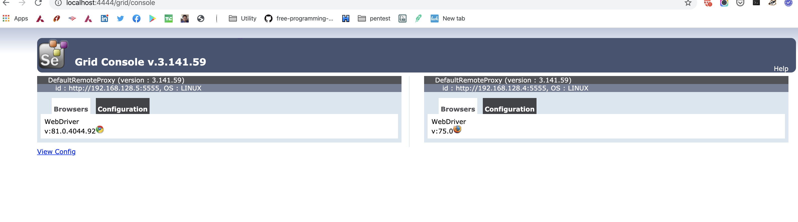
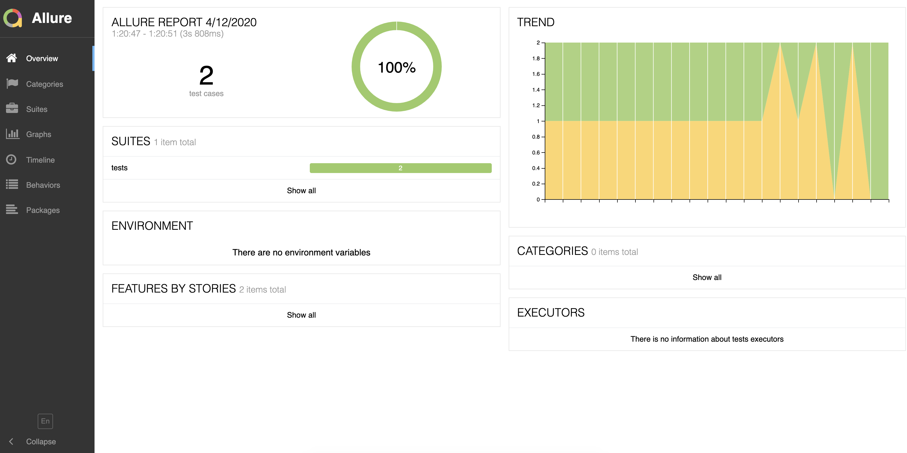
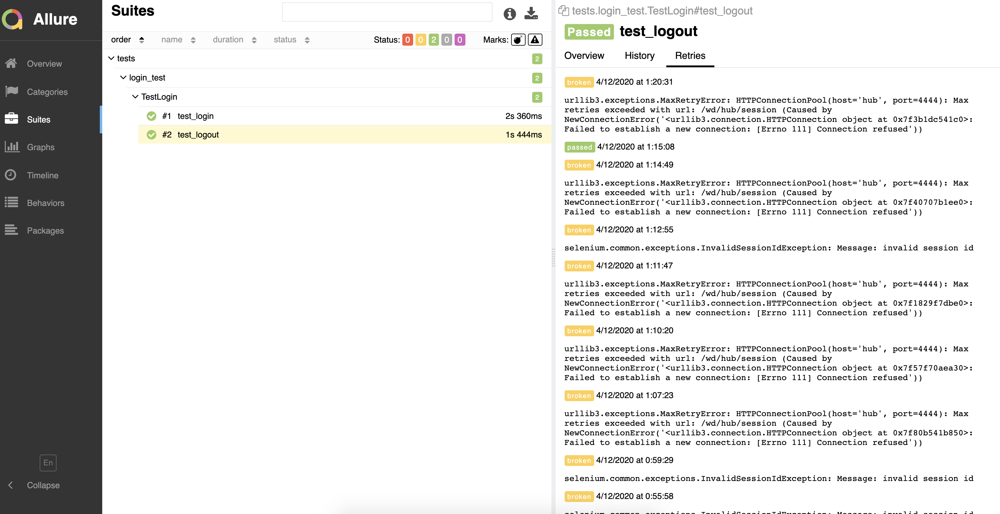
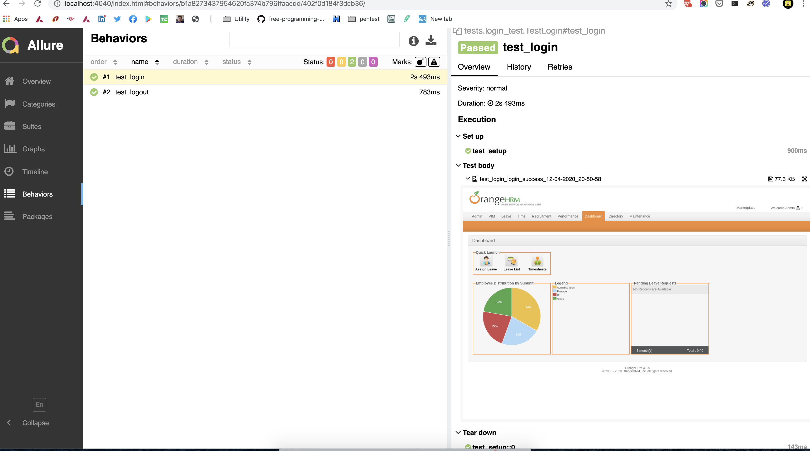
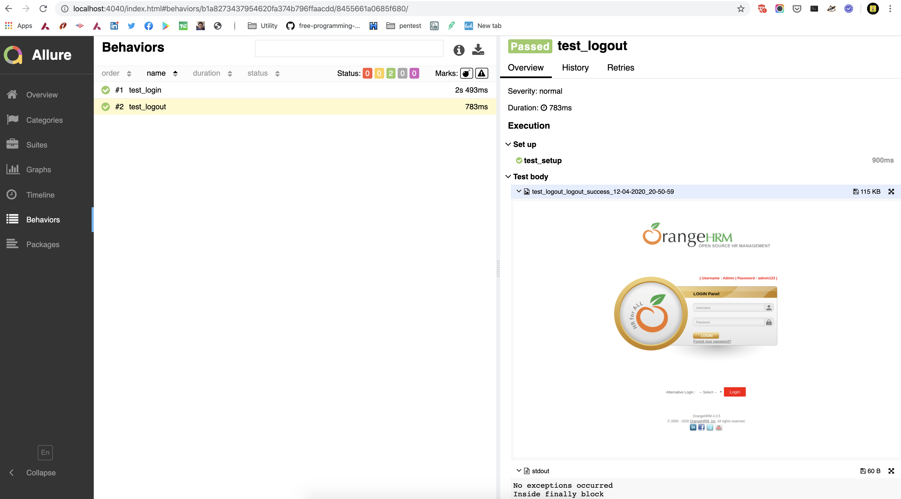
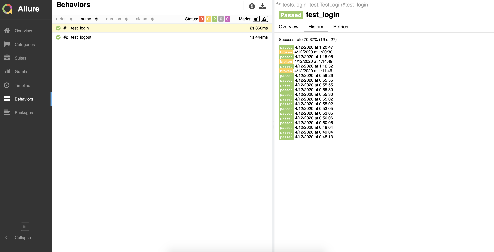
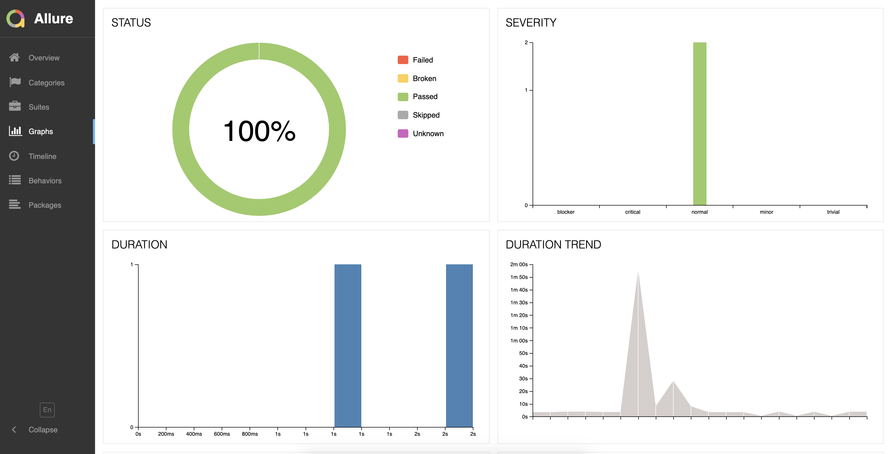
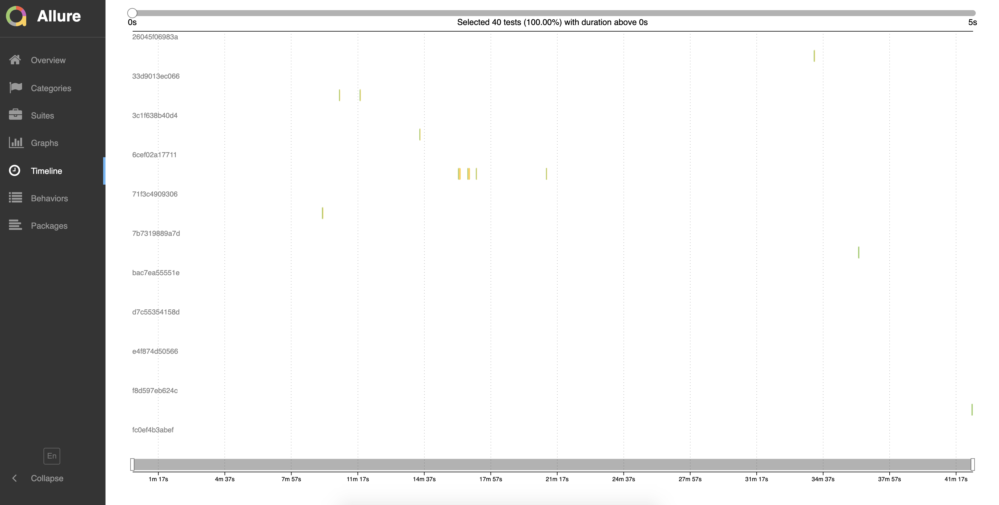

# Dockerized setup of Selenium grid with Allure Reports.

## Pre-requisite

- Docker must be installed.
- Docker compose must be installed.

## Installation

- Clone this repo.
- Make sure working directory is repo root directory.
- Change `BROWSER: chrome` to appropriate browser in `docker-compose.yml` file. ('chrome' or 'firefox' is supported)
- Run command: `docker-compose up -d`

## Usage

- This will create selenium grid with two node. (One for Chrome and another for Firefox)
- Selenium grid is available [here.](localhost:4444/grid/console)

- It will run test against configured BROWSER.
- For running test again just run command: `docker-compose up -d`

## Reports

- Above run generates Allure reports.
- Allure reports available [here.](http://localhost:4040/index.html)
- Please find different screenshot of Allure report.

